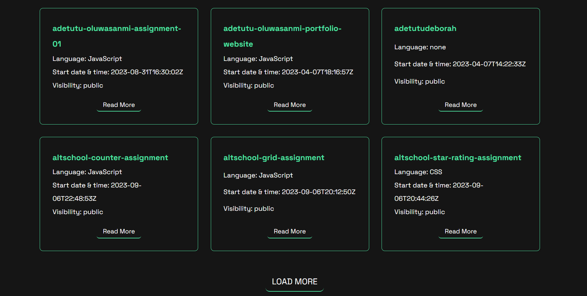

# GitHub Portfolio

This is a solution to the AltSchool Africa School of Engineering Second Semester Project. This is a React application that fetches and displays a list of repositories from a user's GitHub account using the GitHub API.

# Table of contents

- [Overview](#overview)
  - [The challenge](#the-challenge)
  - [Links](#links)
- [My process](#my-process)
  - [Built with](#built-with)
  - [Setting up the repository](#setting-up-the-repository)
  - [Dependencies](#dependencies)
- [Author](#author)

# Overview

## The challenge

- Implement an API fetch of your GitHub portfolio, show a page with a list of all your repositories on GitHub, and create another page showing data for a single repo clicked from the page showing all repos using nested routes while using all the necessary tools in react. 
- Implement an Error Boundary (show a page to test the error boundary) and 404 pages. 
- Good UI and Designs are important. 
- Your code should be well documented with a README.md file that contains all your libraries used for the project.
- Push your code to Github.
- Host your application on Netlify.

### Screenshot



# Links

- [Live site URL]()
- 


# My process

## Built with

- React

## Setting up the repository

Follow these steps to set up the repository on your local machine:

- Install the dependencies by running
```
npm install
```
- Start the development server by running
```
npm run dev
```
- Open `http://localhost:5173/` in your browser to view the app


## Dependencies

The project uses the following libraries and dependencies:

- React
- React Hooks
- React Router
- React Icons
- React Router DOM
- Font Awesome


# Author

- GitHub - [@adetutudeborah](https://github.com/adetutudeborah)


